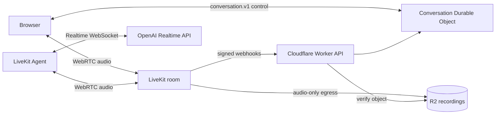
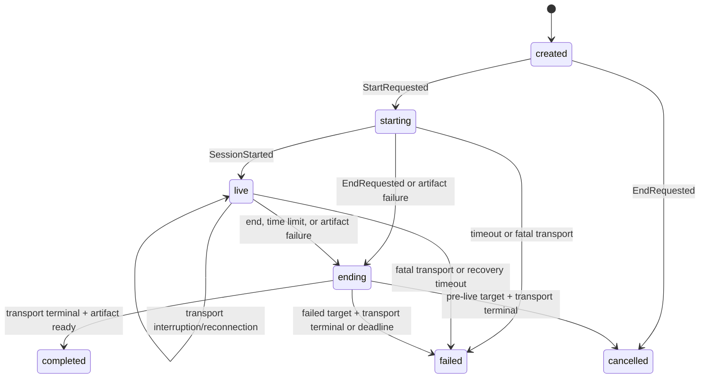

# OpenAI Realtime conversation control plane

This experiment is a provider-neutral control plane for browser voice conversations. The intended
media design uses LiveKit as the browser-facing WebRTC plane. A separately deployed LiveKit Agent
joins the room and uses LiveKit's OpenAI plugin to connect to the Realtime API. Audio does not pass
through the Worker or Durable Object. Cloudflare Workers provide the authenticated control plane,
durable coordination, signed provider webhooks, and recording verification without a custom media
bridge or audio transcoder.

The repository currently contains the examination dashboard and D1 model, the conversation
aggregate and Durable Object transition kernel, a MessagePack WebSocket control protocol, the
signed LiveKit webhook that verifies completed recording objects in R2, and a deploy-ready LiveKit
Agent workspace. The agent loads fixed examination questions through authenticated tools and runs
one LiveKit `AgentTask` per question. The browser can create examinations, start unlimited
sessions, and replay verified recordings without receiving internal R2 keys.

The target LiveKit integration is documented in
[`docs/livekit-architecture.md`](docs/livekit-architecture.md).

## Repository map

The repository separates code by runtime first, then by architectural responsibility:

| Path                   | Runs as                        | Responsibility                                                |
| ---------------------- | ------------------------------ | ------------------------------------------------------------- |
| `src/worker/`          | Cloudflare Worker              | Stateless HTTP API and provider integration boundaries        |
| `src/durable-object/`  | Cloudflare Durable Object      | Authoritative state, persistence, alarms, and control sockets |
| `src/domain/`          | Worker/DO pure modules         | Provider-neutral conversation rules                           |
| `src/shared/protocol/` | Worker/DO shared module        | Sanitized `conversation.v1` wire contract                     |
| `agent/`               | Separate Node.js LiveKit Agent | LiveKit room participant and OpenAI Realtime connection       |

Start with [`src/README.md`](src/README.md) for Cloudflare dependency rules and
[`agent/README.md`](agent/README.md) for the separately deployed agent. The Worker and Durable
Object share one Cloudflare deployment artifact, but they are different runtime components. The
agent is built and deployed independently.

## Architecture



The Durable Object is authoritative for coordination, not media. LiveKit Egress uploads audio-only
recordings directly to R2, and the Worker verifies each expected object before the aggregate marks
the artifact ready.

## Conversation aggregate

Every durable snapshot contains three orthogonal state machines and one shared revision:

- Lifecycle: `created`, `starting`, `live`, `ending`, `completed`, `cancelled`, `failed`
- Transport: `idle`, `connecting`, `connected`, `reconnecting`, `closed`, `failed`
- Artifact: `pending`, `recording`, `uploading`, `ready`, `failed`



`StartRequested` also moves transport to `connecting` at epoch 1. `SessionStarted` is guarded until
transport is connected and recording is active. An interruption keeps lifecycle `live`, moves
transport to `reconnecting`, and starts a non-extendable 20-second recovery window. A successful
reconnect increments the transport epoch.

A successfully ended live conversation requires both a terminal transport and a ready artifact.
Pre-live cancellation and failed outcomes do not require artifact readiness. Recording IDs, object
keys, and etags stay inside the durable snapshot; public DTOs expose only sanitized transport and
artifact status.

## Durable transition kernel

One named `ConversationSession` Durable Object owns one conversation. Its typed RPC surface is:

- `initialize(sessionId, at)` creates or returns the initial snapshot.
- `getState()` returns the internal aggregate.
- `applyEvent({ expectedRevision, event })` atomically applies, deduplicates, or rejects one event.
- `applyIntegrationEvent(...)` applies trusted server observations and broadcasts updated snapshots.

The storage key remains `conversation:snapshot:v1` with schema version 1. This breaking experiment
does not decode the previous provider-specific shape. Snapshot, event receipt, and alarm changes
share one SQLite-backed Durable Object transaction. Every accepted event advances the shared
revision exactly once; rejected events do not modify state.

Transition telemetry contains event IDs, event types, lifecycle tags, revisions, outcomes, and
rejection categories, but never event bodies or complete state.

## Deadlines

The Durable Object uses one persistent alarm for the earliest active deadline among:

- starting
- maximum live duration
- transport reconnection
- ending/transport shutdown
- artifact upload

The alarm reloads current state and applies a deterministic `system:alarm:` event through the same
transactional reducer. Receipts make alarm delivery idempotent across retries and object eviction.
Shutdown gets a 15-second grace window; reconnection gets 20 seconds.

When the live-duration alarm applies `TimeLimitReached`, it transactionally records a shutdown
outbox message and sends it to `oral-exam-livekit-shutdown` after commit. The bounded Queue consumer
uses the existing idempotent LiveKit teardown to stop egress, delete the agent dispatch, and close
the room, which disconnects and terminates the active agent job.

Provision the Queue resources once before the first deployment if they do not already exist:

```sh
pnpm exec wrangler queues create oral-exam-livekit-shutdown
pnpm exec wrangler queues create oral-exam-livekit-shutdown-dlq
```

## HTTP API

The authenticated Worker API exposes:

- `POST /v1/auth/login` — verify a D1 username/password and establish an opaque cookie session.
- `GET /v1/auth/session` — validate the current browser session.
- `POST /v1/auth/logout` — revoke the current session and clear its cookie.
- `GET|POST /v1/examinations` — list all available examinations or create one with ordered fixed
  questions.
- `GET /v1/examinations/:id` — return one examination and its ordered questions.
- `POST /v1/examinations/:id/sessions` — idempotently create a user-owned examination session and
  its conversation.
- `GET /v1/examination-sessions` — list the signed-in user's current and previous sessions.
- `GET /v1/examination-sessions/:id` — return one owned examination session.
- `GET /v1/examination-sessions/:id/recording` — stream an owned, verified R2 recording with HTTP
  byte-range support.
- `POST /v1/conversations` — create from an `Idempotency-Key`.
- `POST /v1/conversations/:id/start` — apply `StartRequested` and return sanitized `starting` state
  with HTTP 202. This endpoint performs no external provisioning.
- `POST /v1/conversations/:id/livekit-access` — idempotently create the LiveKit room, explicit
  agent dispatch, and R2 egress, then return a short-lived room-scoped browser token.
- `DELETE /v1/conversations/:id/livekit-access` — after shutdown begins, idempotently stop egress,
  remove the explicit dispatch, and close the room. Active conversations are rejected.
- `GET /v1/conversations/:id/state` — return sanitized aggregate state.
- `GET /v1/conversations/:id/connect` — upgrade to the binary control WebSocket.
- `POST /v1/integrations/livekit/webhook` — verify and apply signed LiveKit room and egress events.
- `POST /v1/integrations/livekit/agent-events` — authenticate and correlate agent readiness,
  interruption, failure, recovery, and closure observations.
- `GET /v1/integrations/examinations/conversations/:id/current-question` — return the agent's
  authoritative current fixed question.
- `POST /v1/integrations/examinations/conversations/:id/complete-question` — idempotently record
  completion and advance the agent to the next fixed question.

Use `.dev.vars` for local development. Required production control-plane secrets include:

```sh
pnpm exec wrangler secret put AGENT_CALLBACK_TOKEN
pnpm exec wrangler secret put CONVERSATION_ID_SECRET
pnpm exec wrangler secret put LIVEKIT_API_KEY
pnpm exec wrangler secret put LIVEKIT_API_SECRET
pnpm exec wrangler secret put R2_S3_ACCESS_KEY_ID
pnpm exec wrangler secret put R2_S3_SECRET_ACCESS_KEY
```

`LIVEKIT_URL`, `R2_BUCKET_NAME`, `R2_S3_ENDPOINT`, and `ALLOWED_ORIGIN` are non-secret settings
configured per environment. Browser API and `conversation.v1` WebSocket access use the opaque D1
session cookie. Authentication stays in `oral-exam-auth`; examination content and sessions use the
separate EU-jurisdiction `oral-exam-data-dev` database through `EXAM_DB`.

```sh
pnpm exec wrangler d1 create oral-exam-auth
pnpm exec wrangler d1 migrations apply oral-exam-auth --remote
pnpm exec wrangler d1 migrations apply EXAM_DB --remote
pnpm auth:create-user -- --remote oral-exam-auth <username>
```

The LiveKit Cloud project must also have a project webhook configured at
`https://<worker-host>/v1/integrations/livekit/webhook`. Select the same LiveKit API key stored in
the Worker as the webhook signing key. Participant, track, room, and egress callbacks from this
project-level webhook are required for composite transport readiness and recording state; deploying
the endpoint alone does not register it with LiveKit Cloud.

The user helper prompts without echo and sends only a salted one-way password hash to D1. See
`docs/frontend-auth.md` for local setup and session-security details.

To rotate a user's password and revoke their existing browser sessions:

```sh
pnpm auth:change-password -- --remote oral-exam-auth <username>
```

## Recording retention

The authoritative R2 lifecycle policy in `config/r2-lifecycle.json` expires completed objects in
`oral-exam-recordings-dev` 30 days after creation and aborts incomplete multipart uploads after 24
hours. Apply and inspect it with:

```sh
pnpm r2:apply-retention
pnpm r2:verify-retention
```

The apply command intentionally replaces the bucket's complete lifecycle configuration so an older,
less restrictive rule cannot leave recordings behind. R2 physical deletion is asynchronous after
an object expires.

## LiveKit Agent workspace

The separate `agent/` package runs the named agent `oral-exam-agent`. It uses LiveKit's maintained
OpenAI plugin with `gpt-realtime-2.1` and the `marin` voice by default. Override those defaults with
`OPENAI_REALTIME_MODEL` and `OPENAI_REALTIME_VOICE`.

For local use, copy `agent/.env.local.example` to the ignored `agent/.env.local` and set
`OPENAI_API_KEY`. Local runs against LiveKit Cloud also require the three LiveKit project variables.
LiveKit Cloud injects those variables into managed deployments. Dispatched jobs additionally need
`AGENT_CONTROL_PLANE_URL` and the agent-only `AGENT_CALLBACK_TOKEN`. Worker, R2, and future
transcript-processing credentials must not be added to the agent.

Explicit dispatch metadata uses this versioned shape:

```json
{
  "version": 1,
  "conversationId": "<uuid>",
  "roomName": "conversation-<same-uuid>",
  "transportEpoch": 1
}
```

Production jobs reject missing, malformed, or mismatched metadata. Because LiveKit console jobs do
not include dispatch metadata, local console use additionally requires
`AGENT_ALLOW_SYNTHETIC_METADATA=true`.

```sh
pnpm --filter @ai-oral-exam/livekit-agent console
pnpm --filter @ai-oral-exam/livekit-agent dev
pnpm --filter @ai-oral-exam/livekit-agent test
pnpm --filter @ai-oral-exam/livekit-agent test:smoke
```

The LiveKit Cloud deployment is configured in `agent/livekit.toml`. Run deployment commands from
the agent workspace, which contains the standalone lockfile required by LiveKit's container build:

```sh
lk cloud auth
cd agent
lk agent deploy --secrets-file ../agent-secrets.env .
```

The ignored `agent-secrets.env` file should contain `OPENAI_API_KEY`, `AGENT_CONTROL_PLANE_URL`, and
`AGENT_CALLBACK_TOKEN`. A first deployment uses `lk agent create`; subsequent versions use the
checked-in deployment identity with `lk agent deploy`.

## Control protocol

`conversation.v1` messages are MessagePack tuples shaped as
`[version, numericType, messageId, body]`. Version 1 is intentionally incompatible with the former
bridge protocol. Browser messages are:

- `client_hello`
- `session_ready`
- `transport_status`
- `session_closed`
- `artifact_status`
- `end_requested`
- `client_ping`

Mutating messages carry an expected aggregate revision; transport messages also carry an epoch.
Every accepted message receives an acknowledgement and a sanitized authoritative snapshot. Stable
message IDs use the same durable event-receipt deduplication as RPC and alarm events. WebSocket
attachments contain only protocol phase, connection ID, transport epoch, and connection time.
Browser media, readiness, closure, and artifact status messages are non-authoritative UX
observations; only the user end command mutates the aggregate through this socket.

## Verification

```sh
pnpm fmt
pnpm lint
pnpm check
pnpm test:foundation
pnpm --filter @ai-oral-exam/livekit-agent test:smoke # optional, credentialed
pnpm types
pnpm exec wrangler deploy --dry-run
docker build -t ai-oral-exam-livekit-agent .
```

`pnpm test:foundation` runs the deterministic control-plane harness. It sends requests through the
real HTTP router and uses the real `ConversationSession` Durable Object while replacing external
LiveKit, webhook-verification, R2, clock, and ID effects with controlled in-memory ports. See
[`test/harness/README.md`](test/harness/README.md) for its scope and scenario API.

The source-config dry run is `pnpm exec wrangler deploy --dry-run --config wrangler.jsonc`; keep the
explicit config argument in CI and pre-commit verification so a different Wrangler default cannot
silently select another entrypoint.
