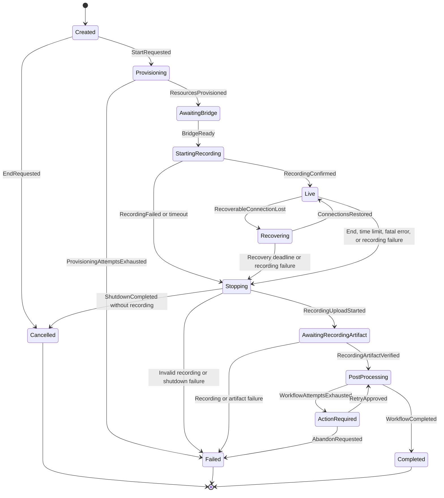

# OpenAI Realtime + Cloudflare RealtimeKit

This repository currently contains only the type-safe conversation lifecycle
state machine and an empty Durable Object shell. It intentionally contains no
RealtimeKit, OpenAI, persistence, networking, or side-effect implementation.

## State machine



## Type-safety model

TypeScript enums cannot contain associated data. `ConversationStateTag` is
therefore paired with a discriminated union whose member payloads are specific
to each state.

`transition(state, event)` only accepts events legal for the exact compile-time
state variant and returns the exact target-state type. Runtime guards remain for
facts that cannot be proven statically, including bridge readiness, bridge
generation freshness, recording ID equality, and R2 object-key equality.

## Commands

```sh
pnpm check
pnpm types
```
