# Conversation finite state machine

`ConversationSession` owns one aggregate containing three coordinated state machines. Every
accepted event advances their shared revision exactly once.

```mermaid
flowchart TB
    subgraph Lifecycle["Lifecycle state"]
        LCreated([created])
        LStarting([starting])
        LLive([live])
        LEnding([ending])
        LCompleted([completed])
        LCancelled([cancelled])
        LFailed([failed])

        LCreated -->|StartRequested| LStarting
        LCreated -->|EndRequested| LCancelled

        LStarting -->|SessionStarted<br/>transport connected + recording active| LLive
        LStarting -->|EndRequested| LEnding
        LStarting -->|ArtifactFailed| LEnding
        LStarting -->|start timeout, fatal transport,<br/>or premature SessionClosed| LFailed

        LLive -->|EndRequested or TimeLimitReached| LEnding
        LLive -->|ArtifactFailed| LEnding
        LLive -->|recovery timeout, fatal transport,<br/>or unexpected SessionClosed| LFailed

        LEnding -->|cancel target + terminal transport| LCancelled
        LEnding -->|complete target + terminal transport<br/>+ verified artifact| LCompleted
        LEnding -->|fail target + terminal transport,<br/>or ending timeout| LFailed
    end

    subgraph Transport["Transport state"]
        TIdle([idle])
        TConnecting([connecting])
        TConnected([connected])
        TReconnecting([reconnecting])
        TClosed([closed])
        TFailed([failed])

        TIdle -->|StartRequested<br/>epoch = 1| TConnecting
        TConnecting -->|TransportConnected| TConnected
        TConnecting -->|fatal error or timeout| TFailed

        TConnected -->|TransportInterrupted<br/>start fixed 20 s deadline| TReconnecting
        TReconnecting -->|repeated interruption<br/>deadline unchanged| TReconnecting
        TReconnecting -->|TransportConnected<br/>epoch = previous + 1| TConnected
        TReconnecting -->|RecoveryDeadlineExceeded| TFailed

        TConnecting -->|SessionClosed| TClosed
        TConnected -->|SessionClosed| TClosed
        TReconnecting -->|SessionClosed| TClosed
        TConnected -->|FatalTransportError| TFailed
        TReconnecting -->|FatalTransportError| TFailed
    end

    subgraph Artifact["Required recording artifact"]
        APending([pending])
        ARecording([recording])
        AUploading([uploading])
        AReady([ready])
        AFailed([failed])

        APending -->|RecordingStarted| ARecording
        ARecording -->|RecordingUploadStarted| AUploading
        AUploading -->|RecordingArtifactVerified<br/>R2 key and recording ID match| AReady

        APending -->|ArtifactFailed| AFailed
        ARecording -->|ArtifactFailed| AFailed
        AUploading -->|ArtifactFailed or upload timeout| AFailed
    end

    TConnected -. required by SessionStarted .-> LLive
    ARecording -. required by SessionStarted .-> LLive
    TClosed -. terminal gate .-> LCompleted
    TFailed -. terminal gate .-> LFailed
    AReady -. completion gate .-> LCompleted
```

Recoverable interruption changes only transport to `reconnecting`; lifecycle remains `live`.
Terminal lifecycle states reject further transitions.
