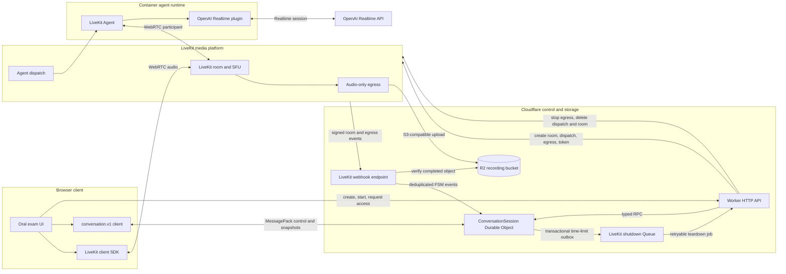
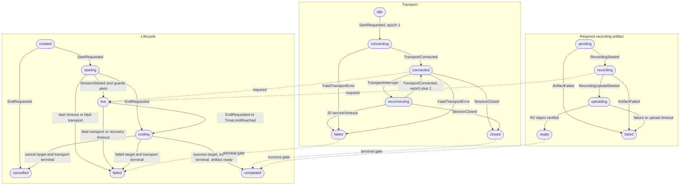

# LiveKit-based voice architecture

## Status and decision

This document defines the target architecture for integrating LiveKit with the conversation
control plane in this repository. The signed LiveKit webhook, R2 artifact-verification boundary,
deploy-ready Node.js agent workspace, and idempotent LiveKit access/dispatch boundary are
implemented. Authenticated agent lifecycle reporting and composite transport readiness are also
implemented. The `oral-exam-agent` deployment is running in the LiveKit Cloud `eu-central` region.

LiveKit is the sole end-user media plane. The browser connects to a LiveKit room over WebRTC, and a
LiveKit Agent joins the same room as a programmatic participant. The agent connects to OpenAI's
Realtime API and publishes the model's audio back into the room. Cloudflare Workers and the
conversation Durable Object remain outside the audio path.

This design deliberately does not create a second, direct browser-to-OpenAI peer connection. A
dual-connection design would duplicate microphone publication and require the browser to republish
the model's remote audio into LiveKit before LiveKit could record it.

## Full system design



The data paths have intentionally different owners:

- Audio: browser, LiveKit, the agent, and OpenAI.
- Durable lifecycle: `ConversationSession` Durable Object.
- Provider orchestration: authenticated Worker endpoints and LiveKit webhooks.
- Recording bytes: LiveKit Egress directly to R2.
- Recording verification: Worker access through the R2 binding before artifact readiness is
  accepted.

## Component responsibilities

### Browser

- Requests a conversation and a short-lived LiveKit participant token.
- Joins exactly one LiveKit room and publishes the microphone track.
- Plays the agent's subscribed audio track.
- Keeps the existing `conversation.v1` control connection for authoritative state snapshots and
  user commands.
- Uses the D1-backed username/password login and opaque, host-only browser session cookie for REST
  and control-WebSocket authentication.
- Never receives an OpenAI API key or LiveKit API secret.

The browser implementation is split into a reusable foundation client and the product UI. The
`@ai-oral-exam/conversation-client` package owns HTTP calls, runtime validation of public responses,
the `conversation.v1` control socket, and LiveKit room/media orchestration. The application under
`web/` owns only presentation, navigation, and product interaction, and imports no control-plane or
domain internals. Fallible client and wire operations return explicit `Result` values so expected
HTTP, validation, protocol, and media failures do not cross these boundaries as exceptions. The
provider-neutral, versioned public schemas live in
`@ai-oral-exam/conversation-contract`; the application receives those types only through the client
package.

### Cloudflare Worker

- Authenticates application requests.
- Keeps `POST /v1/conversations/:id/start` provider-neutral.
- Exposes a separate LiveKit access endpoint that creates or finds the room, configures recording,
  dispatches the agent, and returns restricted browser access credentials.
- Verifies LiveKit webhook signatures before translating webhook payloads into typed conversation
  events.
- Verifies completed R2 objects rather than trusting an egress notification alone.
- Consumes bounded, retryable time-limit shutdown jobs and invokes the idempotent LiveKit teardown
  adapter outside the Durable Object transaction.
- Receives time, identifiers, Durable Object lookup, R2 lookup, webhook verification, and LiveKit
  control through explicit ports assembled by the Worker entrypoint.
- Does not proxy, decode, resample, or persist live audio.

### Conversation Durable Object

- Owns lifecycle, transport, and artifact state, together with the shared revision.
- Applies provider-neutral events transactionally and deduplicates them by event ID.
- Owns start, duration, reconnection, ending, and artifact-upload deadlines through one alarm.
- Transactionally records a LiveKit shutdown outbox message when the duration deadline applies
  `TimeLimitReached`, then hands it to Cloudflare Queues after the state transaction commits.
- Returns explicit `Result` values for reducer, snapshot, aggregate-storage, and alarm failures.
  Failed alarm work is logged and explicitly rescheduled rather than retried through a thrown
  handler exception.
- Stores internal provider identifiers only when needed for correlation; public DTOs remain
  provider-neutral and sanitized.
- Does not call OpenAI or process media.

### LiveKit

- Owns the browser-facing WebRTC room, SFU behavior, participant connectivity, and track delivery.
- Explicitly dispatches the configured agent for each conversation room.
- Records the room through audio-only egress and uploads the output to R2's S3-compatible endpoint.
- Sends signed participant, room, track, and egress events to the Worker.

### LiveKit Agent

- Runs from the Node.js workspace under `agent/` as the explicitly dispatched `oral-exam-agent`.
- Joins the room as the AI participant.
- Uses LiveKit's OpenAI Realtime plugin with configurable model and voice settings, defaulting to
  `gpt-realtime-2.1` and `marin`.
- Currently supplies a minimal helpful-assistant prompt with no tools. Dispatched jobs deliver
  authenticated lifecycle events to the Worker; the OpenAI session's accepted configuration,
  recoverable errors and reconnection, fatal errors, and session closure drive those events.
  Explicitly synthetic console jobs retain the no-op reporter.
- Keeps `OPENAI_API_KEY` in the agent runtime, never in the browser or Durable Object snapshot.

Explicit dispatch metadata is versioned and contains the conversation UUID, the matching
`conversation-<uuid>` room name, and the transport epoch. Production jobs validate this correlation
before opening an OpenAI session. Synthetic metadata is available only through an explicit local
console flag.

## Session establishment

The intended sequence is:

1. The browser creates a conversation.
2. The browser calls the provider-neutral start endpoint. `StartRequested` moves lifecycle to
   `starting` and transport to `connecting` at epoch 1.
3. The browser requests LiveKit access from a separate endpoint.
4. The Worker idempotently creates a room named from the conversation ID, configures audio-only
   egress, explicitly dispatches the agent, and mints a restricted participant token.
5. The browser joins and publishes its microphone track.
6. The agent joins, establishes its OpenAI Realtime session, and publishes model audio.
7. LiveKit starts egress. Authoritative integration observations produce `TransportConnected` and
   `RecordingStarted`.
8. The complete signed evidence set produces `TransportConnected` and then `SessionStarted`. The
   reducer also requires recording to be active.
9. A browser-initiated `EndRequested` calls `DELETE /livekit-access`. When the authoritative duration
   alarm applies `TimeLimitReached`, the same transaction stores a shutdown outbox message; the
   Durable Object sends it to Cloudflare Queues after commit. The Queue consumer stops egress,
   deletes the explicit dispatch, and closes the room. Closing the room disconnects the agent and
   ends its job. A Durable Object lease makes duplicate HTTP, alarm, and Queue delivery retry-safe.

Room names and participant identities must be deterministic enough for retry convergence while
remaining unguessable to unauthorized clients. Each conversation gets a unique room. Do not rely on
agent dispatch embedded only in the first participant token when the room might already exist;
explicit dispatch is the authoritative operation.

The implemented webhook correlation convention is `conversation-<conversation-id>`. The access
adapter uses the same convention and records both the egress ID and the deterministic
`conversations/<conversation-id>/recording.ogg` key. Webhooks must match both correlations, so a
signed provider payload cannot make the Worker inspect an unrelated R2 object.

## Conversation finite state machines

The Durable Object manages one aggregate with three orthogonal state machines. Every accepted event
advances one shared revision exactly once.



Lifecycle remains `live` during a recoverable transport interruption. The transport machine moves
to `reconnecting`, and the existing non-extendable 20-second deadline applies. Reconnection must
increment the transport epoch so delayed observations from an older media session cannot mutate the
current aggregate.

## Authoritative event mapping

| Authoritative observation                                      | Conversation event                   | Notes                                                                        |
| -------------------------------------------------------------- | ------------------------------------ | ---------------------------------------------------------------------------- |
| Browser and agent room participants active, agent media usable | `TransportConnected`                 | Treat transport as composite readiness, not merely browser room join.        |
| Egress begins recording                                        | `RecordingStarted`                   | Store the egress ID internally as the recording correlation ID.              |
| Agent confirms the OpenAI Realtime session is ready            | `SessionStarted`                     | Reducer also requires connected transport and active recording.              |
| Browser or agent connection is interrupted                     | `TransportInterrupted`               | Starts recovery only once; repeated observations cannot extend its deadline. |
| Composite transport recovers                                   | `TransportConnected`                 | Must use the next epoch.                                                     |
| Agent, room, or Realtime connection becomes unrecoverable      | `FatalTransportError`                | Failed transport is terminal.                                                |
| User or duration limit begins shutdown                         | `EndRequested` or `TimeLimitReached` | Stop agent activity and egress idempotently.                                 |
| Egress begins finalization/upload                              | `RecordingUploadStarted`             | Starts the artifact-upload deadline.                                         |
| Successful egress plus verified R2 object                      | `RecordingArtifactVerified`          | Include the verified key and etag internally.                                |
| Failed egress or missing/corrupt R2 object                     | `ArtifactFailed`                     | Successful lifecycle completion is no longer possible.                       |
| Room and agent session are closed                              | `SessionClosed`                      | May arrive before or after artifact readiness.                               |

LiveKit webhook IDs should become event IDs. Only the current `EV_`-prefixed LiveKit ID format is
accepted. Agent-originated observations need their own stable, retry-safe IDs. The existing event
receipt store then makes duplicated webhook delivery and agent retries harmless.

## Proposed API and integration boundaries

Keep the current endpoints and add provider-specific operations behind a narrow adapter:

```text
POST /v1/conversations/:id/livekit-access
DELETE /v1/conversations/:id/livekit-access
POST /v1/integrations/livekit/webhook
POST /v1/integrations/livekit/agent-events
```

The webhook endpoint accepts only LiveKit's `application/webhook+json` content type and verifies the
signed JWT against the exact raw request body with `WebhookReceiver`. It currently maps active
egress to `RecordingStarted`, failed egress to `ArtifactFailed`, successful completed egress to
`RecordingUploadStarted` followed by R2 verification and `RecordingArtifactVerified`, and
`room_finished` to `SessionClosed`. Signed participant and microphone-track events are correlated
with agent Realtime readiness. Because LiveKit track webhooks omit participant kind, the integration
captures the agent identity from the full `participant_joined` payload and uses that identity to
classify later agent track events. Only the complete evidence set establishes `TransportConnected`
and, once recording is active, `SessionStarted`.

The access endpoint is implemented and returns only short-lived client material:

```json
{
  "roomName": "opaque-conversation-room",
  "serverUrl": "wss://project.livekit.cloud",
  "participantToken": "short-lived-jwt"
}
```

Implemented source boundaries are:

```text
src/domain/                              provider-neutral aggregate and deadline rules
src/durable-object/conversation-session.ts
                                         durable state, receipts, alarms, and control sockets
src/shared/livekit-shutdown.ts            versioned Queue message contract
packages/conversation-contract/           sanitized public state and control protocol
packages/conversation-client/             reusable browser control and LiveKit client
src/worker/index.ts                       Wrangler entrypoint and production composition root
src/worker/ports/foundation.ts            interfaces for all foundation external effects
src/worker/adapters/                      Cloudflare, R2, Web Crypto, and LiveKit implementations
src/worker/foundation-dependencies.ts     production adapter assembly
src/worker/http/                          stateless HTTP API, security, and public DTOs
src/worker/integrations/livekit/*-decisions.ts
                                         pure decoding and orchestration policy
src/worker/integrations/livekit/webhook.ts
                                         verified observation executor
src/worker/integrations/livekit/shutdown-queue.ts
                                         bounded retry and provider teardown consumer
agent/                                   separately deployable LiveKit Agent application
```

Provider SDK types must stop at this boundary. The core reducer, public state DTO, and
`conversation.v1` protocol continue to use only the lifecycle, transport, and artifact unions.
Room creation, dispatch, egress, and token minting live beside the webhook under
`src/worker/adapters/livekit.ts` and are exposed through narrow ports to the authenticated
`livekit-access` route. A short Durable Object provisioning lease serializes concurrent access
attempts and stores only the internal dispatch, egress, and expected-object correlations. Provider
calls do not run inside the Durable Object or the provider-neutral start route.

The same port boundary is the primary test seam. Foundation handlers accept dependency objects
instead of constructing SDK clients or reading clocks, random IDs, Durable Object namespaces, and
R2 buckets directly. Production adapters are assembled in `src/worker/index.ts`; tests inject fixed
clocks and IDs plus small structural fakes. This keeps orchestration deterministic without changing
the Durable Object's authoritative state or weakening provider verification.

The deterministic foundation harness under `test/harness/` composes those controlled ports with the
real HTTP router and the real `ConversationSession` binding. A scenario therefore exercises
authentication, routing, integration orchestration, Durable Object RPC and storage, the reducer,
event receipts, and public DTO sanitization as one control-plane unit. The harness records provider
operations and supports one-shot failures so retries and partial progress are inspectable. It does
not replace focused adapter tests: signed LiveKit webhook verification, actual SDK request mapping,
and automatic Durable Object alarm delivery remain separate integration concerns.

Inside the integration boundary, foundational orchestration follows a decode/decide/execute shape:

```text
verified provider input + supplied aggregate state
                         │
                         ▼
           synchronous decoder/decision module
                         │ explicit observation, action, or error
                         ▼
          executor using ports and Durable Object RPC
```

The decision modules contain no binding access, RPC, storage calls, provider writes, random ID
generation, or system-clock reads. LiveKit SDK webhook types terminate in the webhook decoder; the
executor consumes a normalized observation union. Resource reuse/conflict policy, agent event
selection, and composite-readiness transition selection are likewise directly testable without a
Worker runtime. Executors retain ordering, retry, correlation, telemetry, and external effects.

The provisioning lease establishes the expected room name and transport epoch before any provider
calls begin. Matching agent lifecycle and LiveKit media observations are therefore latched while
the lease is either `provisioning` or `ready`; they do not wait for dispatch and egress identifiers
to be committed. This prevents callbacks caused by explicit dispatch from being lost while egress
is still starting. Observations received before any correlation exists return a retryable response,
while mismatched room names and epochs remain rejected. Completing provisioning preserves the
latched evidence and its idempotency receipts.

The matching `DELETE` operation is accepted only once lifecycle is `ending` or terminal. A separate
shutdown lease serializes concurrent requests. Each provider resource is checked before deletion,
so a retry after a partial failure converges without stopping an unrelated recording or room.
`TimeLimitReached` uses the same teardown operation through a Cloudflare Queue. The Queue has bounded
concurrency, five retries, and a dead-letter queue; an invalid or not-provisioned message is
acknowledged rather than retried forever. The Durable Object outbox is deleted only after Queue
acceptance, and duplicate delivery remains safe because shutdown is lease-protected and idempotent.

## Recording and R2

For one exam recording, use audio-only RoomComposite egress. LiveKit can upload to Cloudflare R2 as
S3-compatible storage using the R2 endpoint and path-style addressing. Egress receives a restricted
R2 access key and secret; the Worker continues to use its native R2 binding for verification and
later processing.

Artifact completion has two pieces of evidence:

1. LiveKit reports successful egress completion and its output location.
2. The Worker verifies that the expected object exists in R2 and captures its etag.

Only then should the Durable Object receive `RecordingArtifactVerified`. The FSM intentionally
supports either ordering between transport closure and artifact readiness.

The R2 bucket lifecycle configuration expires all completed objects and aborts incomplete multipart
uploads after 24 hours. R2 performs physical deletion asynchronously after an object expires.

## Security and trust boundaries

- Standard OpenAI and LiveKit API credentials remain server-side.
- Browser LiveKit tokens are short-lived, room-scoped, identity-scoped, and limited to the minimum
  publish/subscribe permissions.
- Webhook signatures are verified over the raw request body before JSON parsing.
- Browser status messages are useful for UX but are not authoritative for recording completion or
  provider failures.
- Conversation IDs, room names, participant identities, and webhook metadata must be checked for
  agreement before applying an event.
- Provider errors exposed through public DTOs are stable application error codes, not raw provider
  messages.

## Deployment

The Cloudflare Worker, Queue consumer, and Durable Object remain one deployment. The shutdown Queue
and its dead-letter queue are separate bound resources. The LiveKit Agent is a second deployment
because it is a persistent media participant that requires a container-style runtime. Start with
LiveKit Cloud Agents unless self-hosting requirements justify operating the agent pool.

Use separate LiveKit projects, agent deployments, R2 credentials, OpenAI projects, and webhook
secrets for development, staging, and production.

## Implementation order

1. Add LiveKit configuration and an internal adapter without changing the aggregate.
2. Implement room access, restricted participant tokens, and explicit agent dispatch. **Implemented.**
3. Build a minimal agent using the OpenAI Realtime plugin. **Implemented as a deploy-ready scaffold.**
4. Translate signed participant and agent readiness events into transport events. **Implemented.**
5. Add audio-only egress to R2 and translate its events into artifact events. **Implemented.**
6. Verify reconnection, duplicated webhooks, both completion orderings, and deadline behavior in
   integration tests.
7. Add post-processing as a separate workflow after the conversation reaches `completed`.

## References

- [OpenAI Realtime API with WebRTC](https://developers.openai.com/api/docs/guides/realtime-webrtc)
- [LiveKit OpenAI integration](https://docs.livekit.io/agents/integrations/openai/)
- [LiveKit OpenAI Realtime plugin](https://docs.livekit.io/agents/models/realtime/plugins/openai/)
- [LiveKit agent deployment](https://docs.livekit.io/deploy/agents/)
- [LiveKit agent dispatch](https://docs.livekit.io/agents/server/agent-dispatch/)
- [LiveKit webhooks and events](https://docs.livekit.io/intro/basics/rooms-participants-tracks/webhooks-events/)
- [LiveKit audio-only egress](https://docs.livekit.io/transport/media/ingress-egress/egress/composite-recording/)
- [LiveKit S3-compatible and R2 outputs](https://docs.livekit.io/transport/media/ingress-egress/egress/outputs/)
